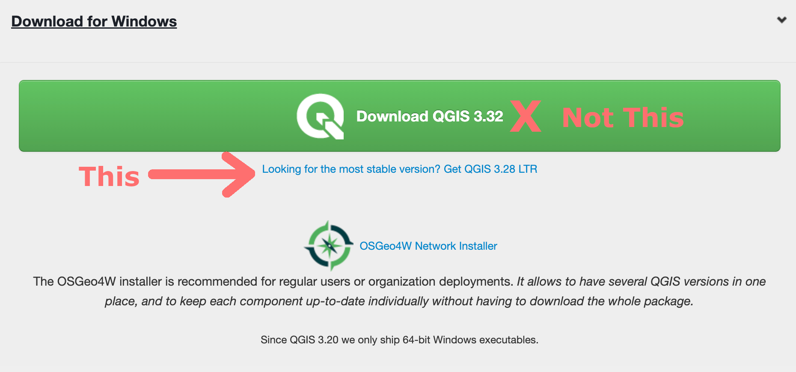
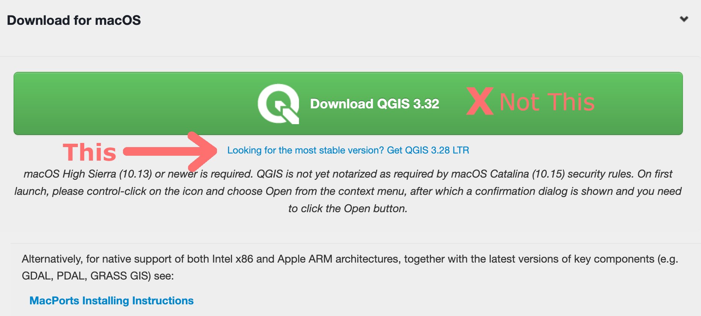

## Learning Objectives : 

1. Recognize geospatial data as information connected to a location.
2. Install the geographic information system software QGIS. 
3. Consider Maps To Communicate Effectively

---

	

## What is QGIS and Why Do I Need It?

Geospatial data are any data that are connected to a specific location. Geospatial data can refer to objects, events, and other real-world phenomena that are relative to a geographical area identified by a latitude and longitude. We use data like this everyday when we navigate to museums, restaurants, or a friend's house using maps on our cellphones. In this course, we are going to analyze geospatial data from satellite remote sensing instruments and create maps visualizing environmental events (e.g., natural disasters or weather events). 

When we work with geospatial data, we refer to the system that organizes, analyzes and visualizes that data as a geographic information system (GIS). QGIS is a GIS software program that supports viewing, editing, printing, and analyzing geospatial data.  If you have ever worked with GIS software before, you might have used a software program called ArcGIS. QGIS is a free and open-source alternative to ArcGIS that is widely used in government, industry, and academic settings. Increasingly, researchers are also turning to programming languages (e.g., R and Python) and writing code in order to process and analyze geospatial data; however, the advantage of QGIS and ArcGIS is that they are menu-driven software programs. 

Each week, you will use QGIS to complete a new tutorial and submit a "Map-of-the-Week" assignment that will allow you to practice working with geospatial data and add new tools to your skillset. 

## Installing QGIS

Head over to <a href="https://qgis.org/en/site/forusers/download.html]" target="_blank">https://qgis.org/en/site/forusers/download.html</a> and download the stable version of QGIS for your operating system (e.g., Mac, Windows or Linux). 

**NOTE: QGIS offers a latest release of its software which is cutting edge and unstable. I suggest downloading the Long Term Release (LTR), which is stable and easier to use. See images below for each operating system:**

###  &nbsp; Windows 

	

Check for the QGIS executable file (.msi) in whichever folder you downloaded it to and open it. Follow the prompts to install the software.

Open QGIS Desktop from the start menu or desktop icon.

###  &nbsp; Mac

	

Check for the QGIS executable file (.dmg) in whichever folder you downloaded it to and open it. Follow the prompts to accept the terms and conditions. To install the software, hold and drag the file into your Applications.

Open QGIS by selecting it in Launchpad or use Go &rarr; Applications and double click on QGIS.

###  &nbsp; Linux

Use your package manager to install the stable version from your distribution's repository or follow these instructions to install a more up to date version : <a href="https://www.qgis.org/en/site/forusers/alldownloads.html#linux]" target="_blank">https://www.qgis.org/en/site/forusers/alldownloads.html#linux</a>.

Congratulations! You have now successfully installed QGIS. In our next tutorial, we will get you up and running to make your first map.

---

## Map of The Week Assignments

1. Identify two maps that you think are interesting; try to find maps that are representing different types of spatial data from one another. Submit the maps (e.g., as links or copy/pasted) into a document before next class along with a brief written description that addresses the following questions: What are the primary and secondary forms of data in the maps? What are all of the elements (e.g., scale bar, latitude/longitude) in the maps? What is interesting about the maps (why did you choose them)? 

---
Recommended Citation: Forsythe, J.D., G.R. Goldsmith, and J.B. Fisher. 2023. Tutorial 0: Observing Earth from Above. Chapman University. https://jeremydforsythe.github.io/icecream-tutorials/

This work is supported by funding from NASA ECOSTRESS Mission Grant #80NSSC23K0309 (I.C.E. C.R.E.A.M.: Integrating Communication of ECOSTRESS Into Community Research, Education, Applications, and Media).
