## Objectives : 

1. Learn the AρρEEARS Interface
2. Download & Visualize Temperature Data From ECOSTRESS in QGIS
---

## Welcome Back! 

Today we are introducing AρρEEARS, The Application for Extracting and Exploring Analysis Ready Samples, which is a system designed to efficiently connect users with federal databases. We are going to use it to access ECOSTRESS satellite data in near real-time. 

To begin head over to <a href="https://appeears.earthdatacloud.nasa.gov/" target="_blank"> https://appeears.earthdatacloud.nasa.gov/</a>. Click the *Sign In* button to register for an Earthdata account or login if you already have one.

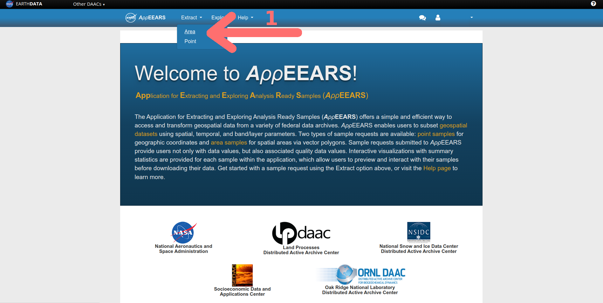

1. To access satellite data use the *Extract* dropdown menu to select *Area*. 
2. Next select *Start a New Request*.

---
## Motivation For Today's Tutorial : Death Valley

ECOSTRESS primarily measures surface temperatures, so let's see what it reads at one of the hottest places in the world, Death Valley California. While the highest recorded ground temperature was verified at 201 degrees F on July 15, 1972, it recently had one of the hottest months on record where air temperatures reached upwards of 128 degrees F in July of 2023. Let's use ECOSTRESS to observe the ground temperatures for those days to see how close it was to breaking the ground surface temperature record.

**NOTE: ECOSTRESS launched on July 9, 2018, so as you think about potential projects, your data can not start before then.**

---

## Accessing ECOSTRESS Data Through AρρEEARS

### Create A Request

3. Select the *Start a new request* to request data for a new area and new time period.
4. Enter a useful name for the request you are going to submit, maybe something like "Death Valley Temperature Experiment".

Now we need to tell AρρEEARS what your geographic area of interest (AOI) is, in this case Death Valley National Park in California. This can be accomplished a few different ways:
* Using the map interface to draw a rectangle or polygon that encompasses your AOI.
* Uploading a shapefile the describes your AOI.	

Today we are going to use a shapefile describing a polygon of the park boundaries that I already drew for you in QGIS. In later tutorials you will draw your own.

5. Download the <a href="https://jeremydforsythe.github.io/icecream-tutorials/Tutorial1_DataBasics/DeathValleyNationalPark.zip" target="_blank"> DeathValleyNationalPark.zip</a> shapefile and save it somewhere you can remember. A folder containing all the files of today's tutorial sounds effective and orderly. 

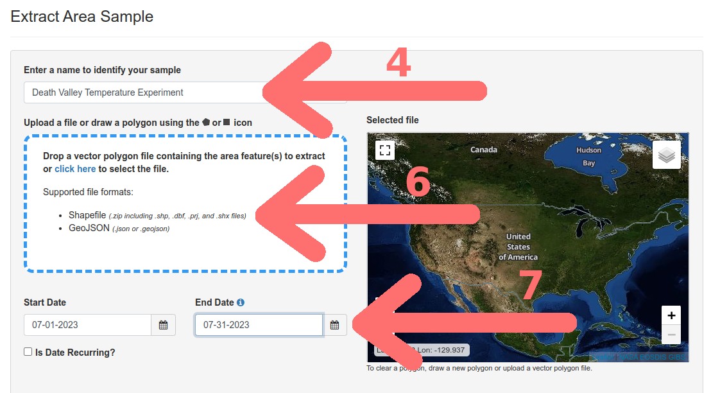

6. Drag and drop (or use the *click here to select the file* link) to upload the shapefile DeathValleyNationalPark.zip. The map should update with a polygon encompassing Death Valley National Park.
7. Update the Start and End Date Fields for our month of interest, July 2023.

AρρEEARS is an interface that provides access to a wealth of different data products, we are primarily focusing on the ECOSTRESS satellite.

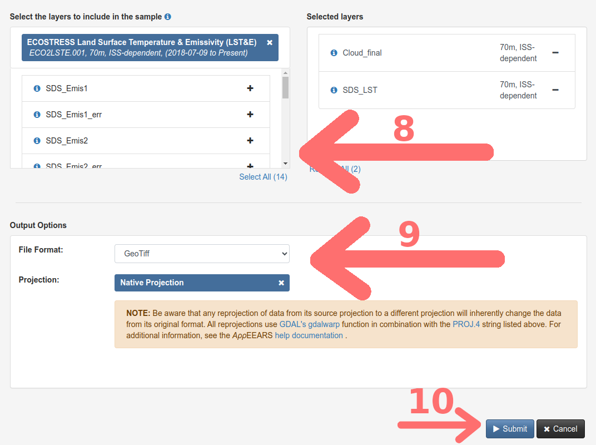

8. Under *Select the layers to include in the sample* type the word "ECOSTRESS" and scroll until you can click on *ECOSTRESS Land Surface Temperature & Emissivity (LST&E)*. From there scroll until you see the Land Surface Temperature (*SDS_LST*) option. Click on the "+" sign to add the layer into your cart. Next search for "Cloud" and add *Cloud_final* from the *ECOSTRESS Cloud Mask Instantaneous* category to your selected layers cart.

If you are curious to learn more about the ECOSTRESS Mission's data, you can find all sorts of interesting facts here: <a href="https://lpdaac.usgs.gov/data/get-started-data/collection-overview/missions/ecostress-overview/" target="_blank"> https://lpdaac.usgs.gov/data/get-started-data/collection-overview/missions/ecostress-overview/</a>.

9. Under *Output Options* we want to use GeoTIFF (Geographic Tagged Image File Format; essentially an image file where the corresponding geographic information is embedded in the file) and *Native Projection* for projection.
10. Click *Submit* to complete the data request. At the top you should see a green banner:

### Data Check

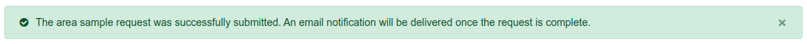

11. After AρρEEARS crunches the numbers and retrieves your data from the depths of its database you will receive an email with the subject AρρEEARS Request Complete at whichever email address you used to sign up. Most small requests will take 15 minutes or less, larger ones can take upwards of an hour. You also track the progress of your request and access the data at https://appeears.earthdatacloud.nasa.gov/explore. Follow the *Explore* link in your completed request email (or via the explore menu tab on the AρρEEARS homepage) to access your data.

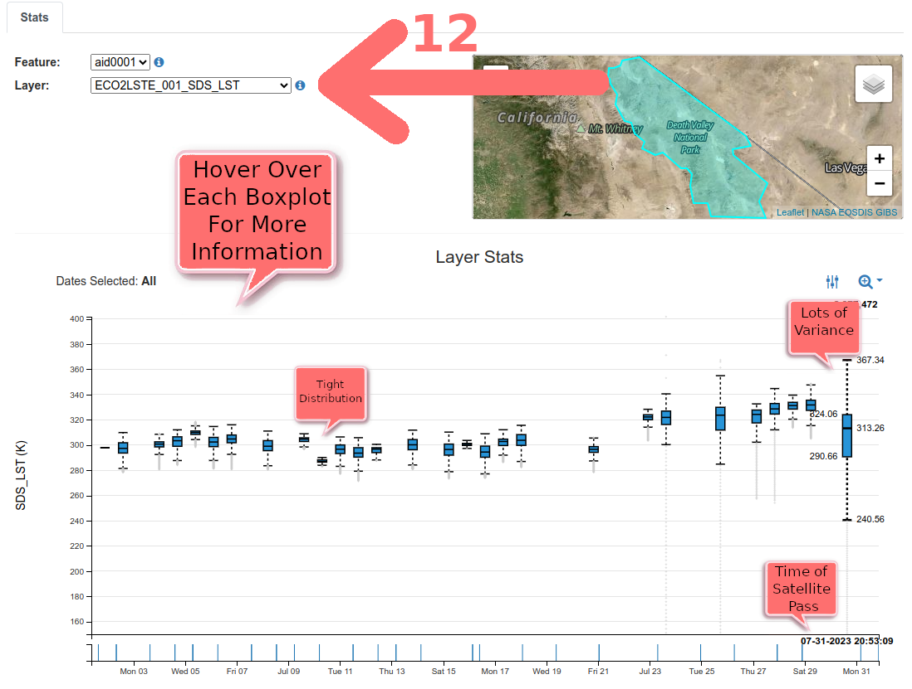

12. Before we download the files we should take a look at what we have using the built in AρρEEARS visualizations. First make sure the Land Surface Temperature (LST) layer is selected. Under *Layer Stats* you will see a boxplot timeseries of the temperature data across the range of dates (x-axis) and observed temperature that the satellite recorded for each date (y-axis). Hover over the boxplots to see all sorts of useful information, including the date and time of day of the satellite pass. While 7/26/2023 had the hottest air temperature of the month, our observations of surface temperature are among the lowest! Why is that? Have we discovered some new physical property of the desert? Well no, the satellite pass was simply at 9:49 am, not exactly the hottest part of the day.

**Note: ECOSTRESS makes temperature observations in Kelvin, not degrees Fahrenheit or Celsius.** 

You are likely noticing that the distribution of temperatures for a given pass from the satellite is quite variable. Some instances, like on Tuesday 7/11/2023, the range is tightly confined around the mean, while others like Monday 7/31/2023 show considerable variance. If this was a different locale, it could mean that there is a lot of variation in surface temperatures across the geographic range we selected with the shapefile. However, in this case we know death valley is consistently hot desert, so it is more likely there is another culprit, clouds.

  

Satellite observations have many advantages over other types of measurements. They have continuity through space and time, but they can not accurately measure through clouds. To handle this, NASA has built cloud detection algorithms and included that data in AρρEEARS.

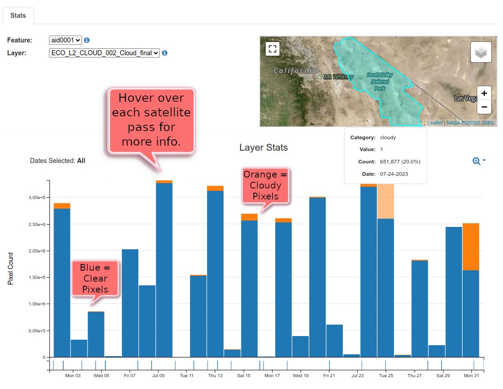

13. Change the layer in the built in stats visualizer to Cloud_final. Now we have a different visualization, the output of the cloud detecting algorithm. The bar chart breaks down the percentage of pixels that are clear (represented in blue) and pixels that have clouds (orange). Satellite passes that are cloud free or have few clouds tend to have better data with less outliers given that there is little interference. For our temperature map let's pick the hottest cloud free day, 7/28/2023. 

### Download The Data

Output data files returned by AppEEARS have the following naming convention:  

`<ProductShortName>.<Version>_<LayerName>_doy<Year><JulianDate>_<AppEEARSFeatureID>.<FileFormat>`  

Example output file name (.tif): 

   ECO2LSTE.001_SDS_LST_doy2023209214149_aid0001.tif 

**where:**  

    <ProductShortName> .......... ECO2LSTE 
    <Version> ................... 001  
    <LayerName> ................. SDS_LST 
    <Year> ...................... 2023  
    <JulianDate> ................ 209  
    <AppEEARSFeatureID> ......... aid0001 
    <FileFormat> ................ tif

14. Access the download page by scrolling to the top of the page, selecting the *Explore* menu and selecting the middle button next to your request, *Download the contents of the request* . Use the Julien Calendar and file naming convention listed above to determine what filename we need to download the land surface temperature data for 7/28/2023. There can be multiple files that match the date and layer you requested, in this case there are two. Download both files to a folder on your computer that you can access, the same folder that you saved the DeathValleyNationalPark.zip shapefile would be ideal.

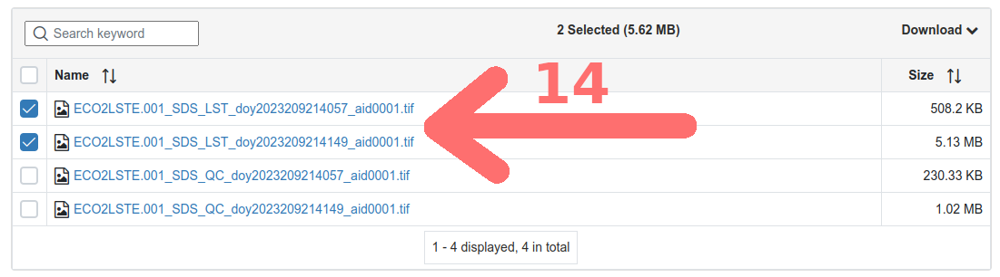

---
## Visualizing the Death Valley Surface Temperature Data in QGIS

### Adding a Google Satellite Basemap

In the last tutorial we added in a simple basemap through a service included in the base QGIS installation. Today we are going to expand QGIS's functionality by using an available plugin, HCMGIS. Plugins are external pieces of software that add useful features to QGIS. 

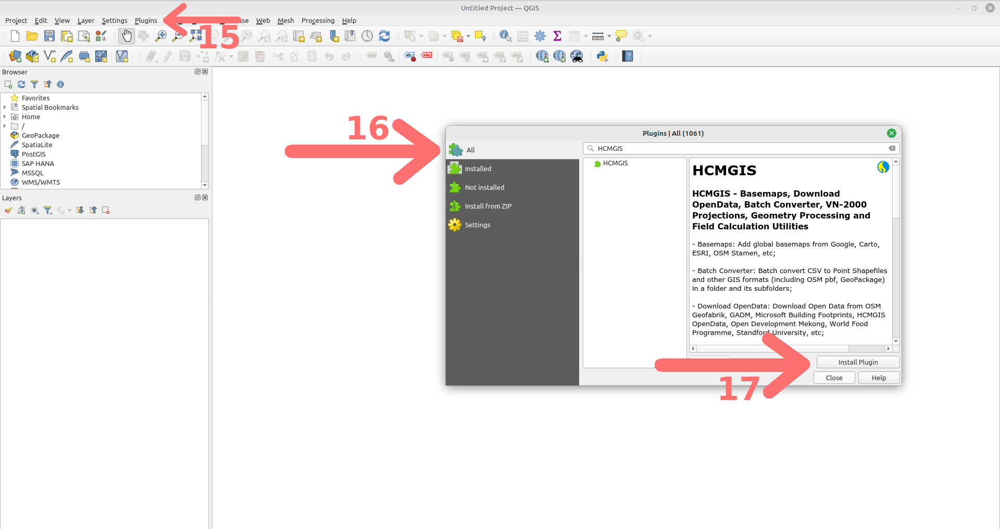

15. Open QGIS and start a new project by selecting the *Project* menu &rarr; then *New*. To install the HCMGIS plugin, click on the *Plugins* drop down menu and select *Manage and Install Plugins*.
16. In the next window, make sure *All* is selected in the first window pane and search for HCMGIS. HCMGIS is plugin that allows for easy imports of a wide selection of basemaps.
17. Click *Install Plugin* and wait for the installation to complete.

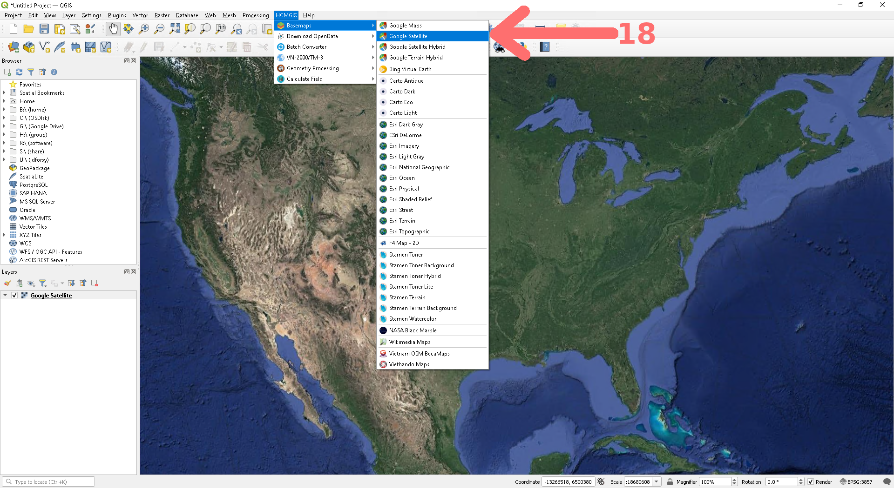

18. Now to quickly and easily add a basemap, all you need to do is find the *HCMGIS* menu bar, select *Basemap*, then pick your preference. For today's map let's use *Google Satellite*, though you could play around with other options. Some of my other favorites are "ESRI Imagery", "ESRI Delorme", "Stamen Terrain", and "NASA Black Marble", though their usefulness is highly dependent on the goal of your map. Note that clicking on a basemap type automatically adds a new layer to your map, as seen in the layer browser window.

### Importing Our ECOSTRESS Death Valley Layer

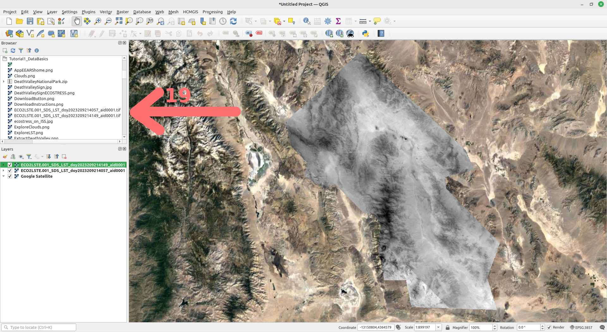

19. Use the *browser* window to find the folder that you saved the two land surface temperature tif files in. Double click each file to add them to your map. Again notice they now are listed in the *Layers* window as well.

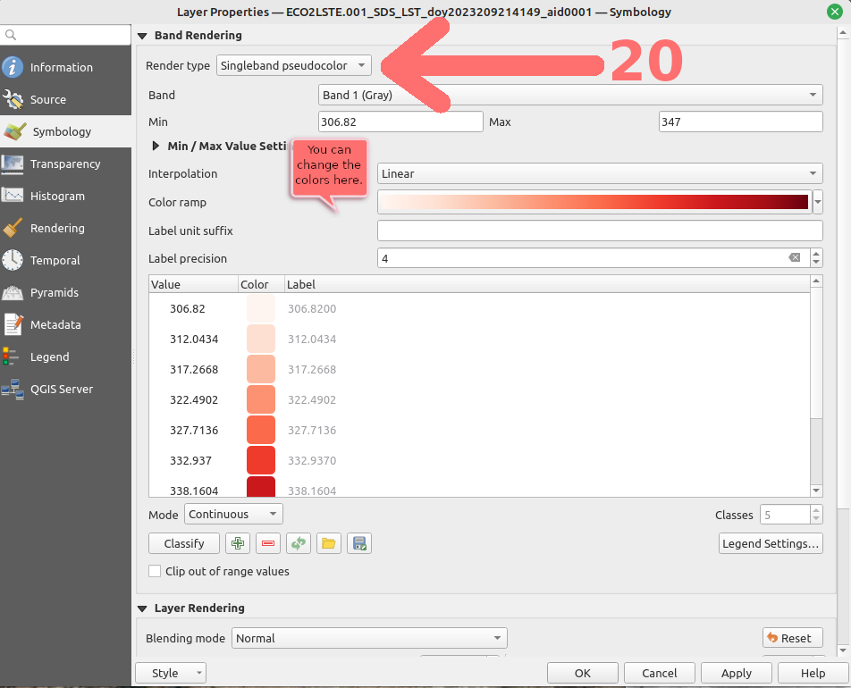

20. Congrats! You now have ECOSTRESS data on a map. But wait... let's make it look just a little better before you celebrate your win. QGIS doesn't know what kind of data this is and has defaulted to displaying the information in grayscale, which isn't that useful to our eyes. For each land surface temperature layer, right click on the layer name in the *Layers* window and select *Layer Properties*. On the menu bar to the left select *Symbology* and change the *Render type* to Singleband pseudocolor. Since this is heat, I am going with the red color ramp. QGIS has automatically determined the minimum and maximum values from the datafiles, however we have two files so we need to make them match. Use 306.82 as the minimum and 347 as the maximum for both layers. Click apply.

21. Lastly add in the border from the DeathValleyNationalPark.zip shapefile. In the *Browser* window expand the zip file using the small arrow next to the filename. Double click on *Death Valley National Park.shp* to add the layer. Right click on the layer in the *Layers* window and change it's symbology to *outline blue*. 

22. Now we can celebrate... Your map should resemble the one below:

**NOTE: There was not full data coverage for the entire park available, that is why the Northern most part of the park does not have any color overlayed. This happens sometimes due to the orbit the satellite takes.**

23. Save you QGIS Project somewhere convenient, perhaps in the folder with all of the other files in this tutorial, by going to the *Project* menu bar at the top and selecting *Save As...*. Keep the file format as .QGZ.

---

## Map of The Week Assignments

1. Watch the Youtube Video: "Why All Maps Are Wrong" at https://youtu.be/kIID5FDi2JQ
2. Give the article <a href="https://open.lib.umn.edu/mapping/chapter/7-lying-with-maps/" target="_blank"> Lying With Maps</a> from the University of Minnesota a read. 
3. Find two maps that you think are interesting, cool, or exceptionally well made and submit them for next class along with a brief description of why you picked those two.
---
Citation: Forsythe, Goldsmith, Fisher 2023. 