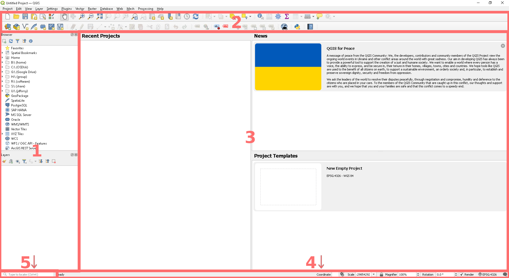
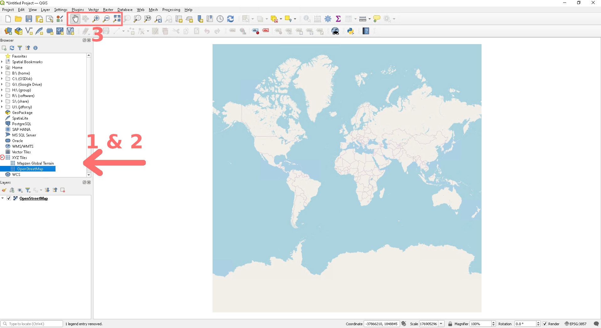
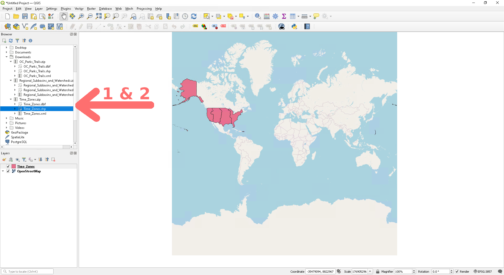
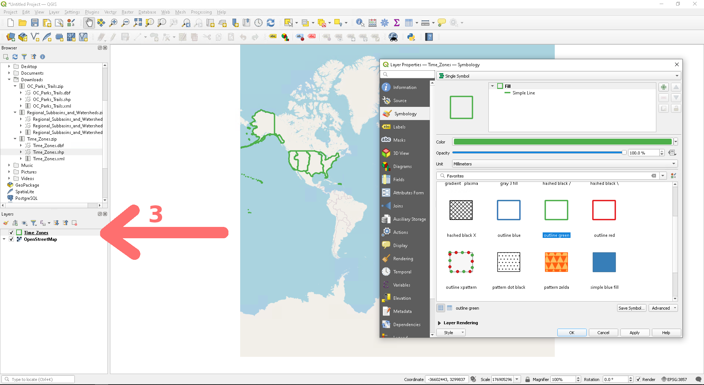
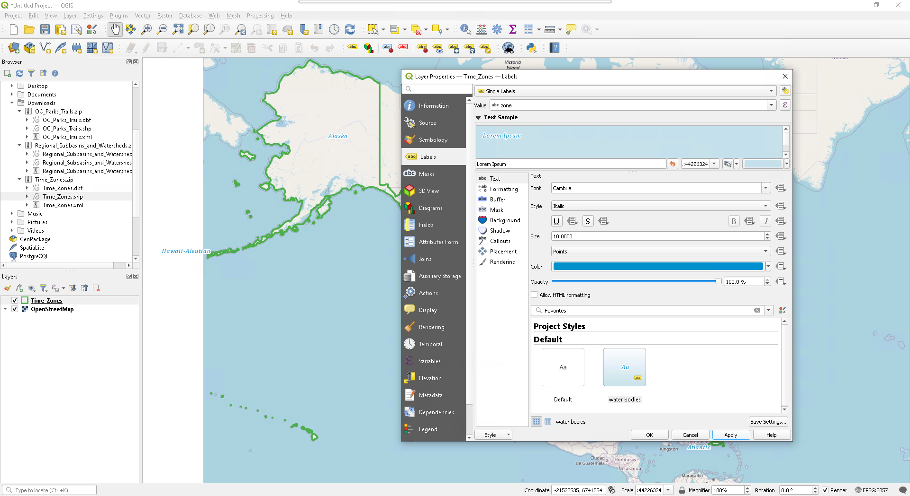
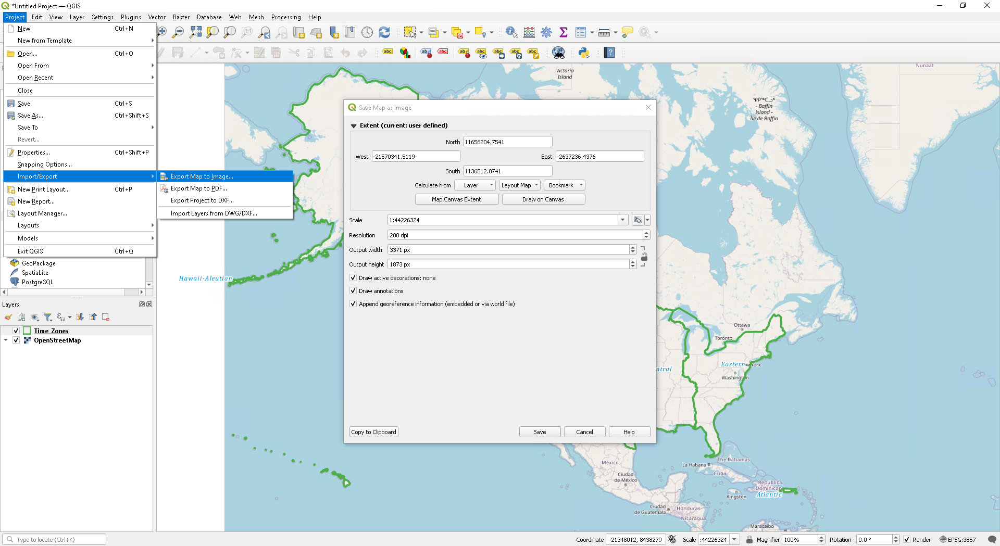
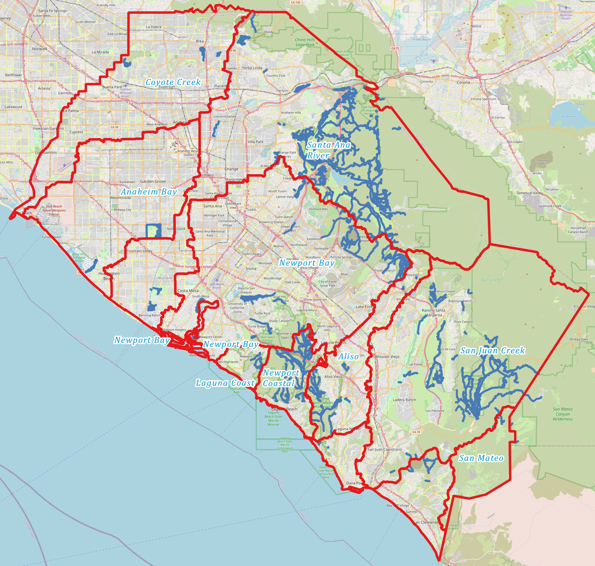

# Tutorial #3: Making Basic Maps In QGIS

Observing Earth from Above (Env 329) - Fall 2023

Schmid College of Science and Technology

Chapman University

---

## Objectives : 

1. Get Acquainted With QGIS's Toolsbars, Buttons, & Layout
---

	

## Getting To Know QGIS

While you wait for A&#961;&#961;EEARS to crunch the numbers and retrieve your data from the depths of its database, let's have an introduction to QGIS, the software you downloaded in the previous tutorial. 

On Windows, open QGIS Desktop from the start menu or desktop icon. 

On Mac, open QGIS by selecting it in Launchpad or use Go &rarr; Applications and double-click on QGIS.

Your screen will likely resemble something like this:

	

1. **Browser Panel & Layers List**
   * The browser panel lets you easily navigate files and databases. We will use it to import map layers and satellite data.
   * In the layers list, you will see all the map layers we have imported for the given project we are working on. Layer examples include a base map (like Google maps), satellite [raster](https://en.wikipedia.org/wiki/Raster_graphics) data (pixels each with a given value...like temperature), and [vector](https://en.wikipedia.org/wiki/Vector_graphics) data (points, lines, shapes...like roads).
2. **Toolbars**
   * The common tools can be found in the toolbars. For example, the *Project* toolbar allows you to save, load, print, and start a new project.
3. **Main Work Area / Map canvas**
   * This is where the map itself is displayed. In the map canvas, you can interact with the visible layers: zoom in/out, move the map, select features and many other operations.
4. **Status bar**
   * Shows you information about the current map. Also allows you to adjust the map scale, the map rotation, and see the mouse cursor’s coordinates on the map.
5. **Locator bar**
   * Within this bar, you can quickly access almost all of the objects and functions of QGIS: layers, layer features, algorithms, spatial bookmarks, etc, by typing in the search bar.

---
## Try It Out! Explore Your First Map...

### I. Add a Basemap Layer

	 

1. In the browser window, expand your options by clicking on the small arrow next to *XYZ Tiles*.
2. Double-click on *Open Street Map* to load in a basic open-source map. You will notice that we just added a layer to the layer window below.
3. You can zoom in and out with the magnifying glass icons in the toolbar. The little hand is the pan map function, which allows you to move the map around when you are zoomed in. Try finding your home or a favorite place in the world. To reset to the default view, you can use the zoom full function (magnifying glass with the arrows in all directions).

### II. Add in an Interesting Layer via Shapefiles

[Shapefiles](https://en.wikipedia.org/wiki/Shapefile) are a common geospatial file type that stores locations, points, lines, and shapes.

1. Download this zipped folder from our website to your local computer. Make sure you save it to a dedicated project folder.
   * <a href="https://jeremydforsythe.github.io/icecream-tutorials/MakingBasicMapsInQGIS/Time_Zones.zip" target="_blank"> US Timezones</a>

	

2. After you have downloaded the file, use the browser window to locate *Time_Zones.zip* in the folder in which you saved it. Use the little arrow to expand the zip file and double-click on the *Time_Zones.shp* shapefile. Just as before, we have now added a new layer to our map.

	

3. This looks a little clunky, so let's make it more readable and useful. Right click on Windows/Linux, or control click on Mac, to open up the properties window. Navigate to the symbology window and select green outline. Click *Apply* and *OK*.  Then zoom and pan the map to center on North America, given that these are only US Timezones.

	

4. Next let's add labels. Open the Time Zone properties back up and navigate to the *Labels* window. From the dropdown menu at the top select *Single Labels*. Play around with the options to adjust the colors to your preferences, or maybe use one of the included styles (e.g., *water bodies*). Click *Apply* and *OK*. 

	

5. Lastly, we want to save your map so you can marvel at your work anytime you'd like and share it with friends at parties. From the *Project* menu navigate to *Import/Export* and select *Export Map To Image*. By default, it will use the [extent](https://en.wikipedia.org/wiki/Map_extent) that you have in the viewer. I recommend increasing the resolution to 200 DPI. You will submit this map later, so save it somewhere you can remember. High-five! You have made a map. 

### Bonus

If you still have time, and are so inclined, you can check out these other interesting shapefiles from the Orange County GIS Database:

   * <a href="https://jeremydforsythe.github.io/icecream-tutorials/MakingBasicMapsInQGIS/Regional_Subbasins_and_Watersheds.zip" target="_blank"> Watersheds of Orange County</a>
   * <a href="https://jeremydforsythe.github.io/icecream-tutorials/MakingBasicMapsInQGIS/OC_Parks_Trails.zip" target="_blank"> Hiking Trails of Orange County</a>

	

---

Now, it is time to check in on the progress of your A&#961;&#961;EEARS request. You can return to the Data Basics tutorial by  <a href="https://jeremydforsythe.github.io/icecream-tutorials/Tutorial2_AccessingRemoteSensingDataWithAppears/Tutorial2_AccessingRemoteSensingDataWithAppears.html" target="_blank"> clicking here.</a>

---
Recommended Citation: Forsythe, J.D., G.R. Goldsmith, and J.B. Fisher. 2023. Tutorial 3: Observing Earth from Above. Chapman University. https://jeremydforsythe.github.io/icecream-tutorials/

This work is supported by funding from NASA ECOSTRESS Mission Grant #80NSSC23K0309 (I.C.E. C.R.E.A.M.: Integrating Communication of ECOSTRESS Into Community Research, Education, Applications, and Media).
