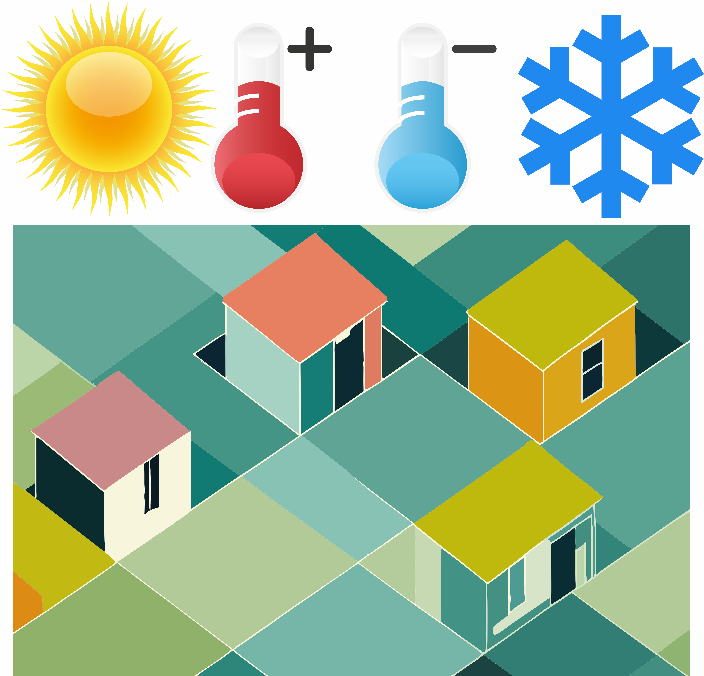

## Objectives : 

1. Create your own shapefiles in QGIS. 
2. Produce a temperature map of the highest and lowest temperatures for your hometown, favorite place you lived, or your top place you want to move to.

---
Foster Valley NY Latitude: 42.12586887 Longitude: -76.13285070. Type in 42.12586887,-76.13285070.
## Motivation For Today's Tutorial : Temperature Competition

Today we are going to pull together all of the skills you have learned so far and enter you into a little competition to see who has the hottest and coldest hometown temperatures for 2022. 

---
## New Skills 
### Creating A Shapefile in QGIS

### Analyzing ECOSTRESS with Snow Data

## Temperature Competition

Use all of the skills you have learned so far to generate a map like the one below that I created for my hometown, Foster Valley. Referring to previous tutorials is an excellent idea. You could also ask your classmates if you get stuck, but remember to complete the work on your own. 

**Procedure:**

1. Create a shapefile for your hometown, favorite place you have lived, or location you most want to move to.
2. Create a new request in AρρEEARS, upload your shapefile, and download ECOSTRESS land surface temperature data for the hottest and coldest passes while being careful of snow and clouds. 
3. Create a map, like the one below I made for my hometown, that shows the temperature in degrees Fahrenheit. 

**NOTE: It is entirely possible for ECOSTRESS to produce bad data with extreme and insane values for land surface temperature. Make sure you are filtering for clouds and snow. Also keep in mind that the theoretical maximum possible ground surface temperature has been estimated to be 212 degrees Fahrenheit.**

---

## Map of the Week Assignment

---
Citation: Forsythe, Goldsmith, Fisher 2023. 
